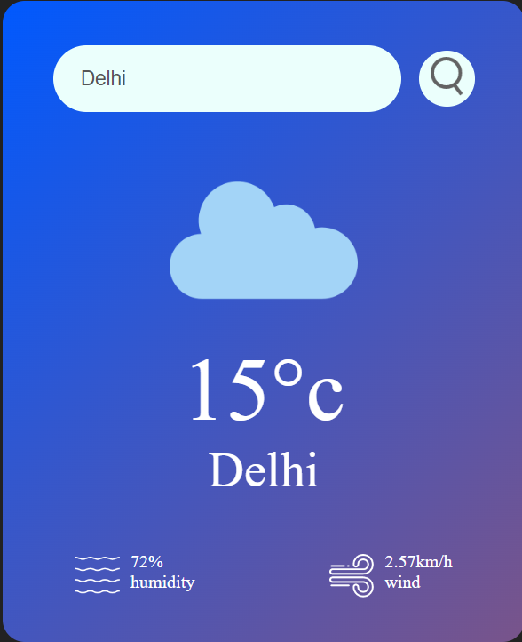

# Weather Forecasting Website

## Overview

Welcome to the [weather-app] - your one-stop solution for checking the current weather conditions of any city. This user-friendly website provides real-time weather updates, detailed forecasts, and a seamless experience.

## Demo

Check out our live demo [here]([https://prashant2002pd.github.io/weather-app/]) to experience the simplicity and effectiveness of [weather].

## Features

- **Current Weather:** Get instant updates on the current weather in any city.
- **Responsive Design:** Enjoy a consistent and user-friendly experience across devices.
- **Search Functionality:** Easily find weather information for any location.
- **Detailed Information:** Access additional details such as humidity, wind speed, and more.
- **Intuitive UI:** Navigate the website effortlessly for a quick and pleasant weather-checking experience.

## Contributing
We welcome contributions! Follow these steps to contribute:

Fork the project.
- Create a new branch: git checkout -b feature/AmazingFeature
- Commit your changes: git commit -m 'Add some AmazingFeature'
- Push to the branch: git push origin feature/AmazingFeature
- Open a pull request.
